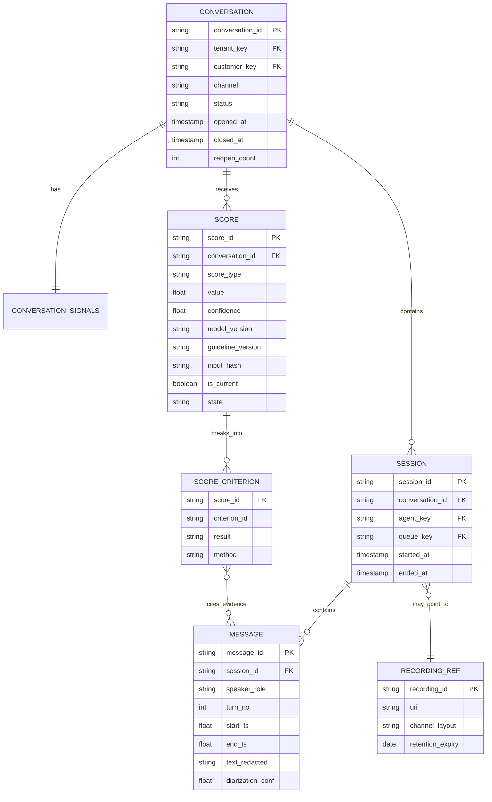

# XOOS Analytics — Transaction Data Pipeline: Design Context

**Status:** Draft for design tuning
**Last updated:** September 2026
**Owner:** XOOS Analytics
**Related:** `XOOS_Analytics_Context.md`, `transaction_pipeline_architecture.html`, `transaction_data_flow_grain.mmd`, XOOS Analytics Features Spreadsheet

---

## 1. Purpose

Bring the highest-resolution transaction data (call recordings, full transcriptions, chat and email content, full CRM conversation detail) into the governed medallion pipeline, so that:

1. The XOOS backend can run AI scoring (drivers, QA against guidelines, CSAT) on **clean, compact, governed inputs** instead of massive raw data on the application side.
2. Backend scores are displayed **online** in XOOS and then **reverse-refreshed** into the warehouse.
3. The warehouse **enriches** those scores with existing dimensions (agent, queue, tenant, training, WFM, CRM outcomes) and serves both **interaction-level scores** and **classic aggregated analytics** from one source of truth.

### Primary analytical goals

| Goal | Primary output | Grain |
|---|---|---|
| Contact drivers | Intent → reason → outcome classification | Conversation |
| QA against a guideline | Score per atomic criterion, with evidence | Conversation × criterion |
| CSAT | Predicted CSAT on 100% of conversations, calibrated against surveyed CSAT | Conversation |

Individual interaction scores are the priority. Aggregates are rollups of interaction-level facts, never computed independently.

---

## 2. Agreed principles

1. **Transform the expensive raw material once.** Transcription and diarization happen once at ingestion. Downstream work reads text, never audio.
2. **No recordings in the warehouse.** Audio stays in Blob/S3 for the retention period; the warehouse holds a pointer.
3. **No PII in the warehouse.** Redaction happens at ingestion for all channels, using typed placeholders.
4. **Scoring stays in the backend (for now).** The warehouse feeds it and governs its outputs; it does not replace it.
5. **One-way contract.** The backend reads only Silver External, which never exposes scores. Loops are prevented structurally.
6. **Backend results are a source.** Scores land in Bronze and are conformed like any other source. They never write directly to Gold.
7. **Each metric is defined once.** Definitions live in Silver refined (or the semantic layer). Gold consumes and never recalculates.
8. **Lowest sufficient resolution.** Each consumer gets the lowest resolution that still answers its question.
9. **Visible provenance.** Every metric is labeled deterministic or model-derived, with version and confidence where applicable.
10. **Tool layer vs. backbone layer.** This pipeline is backbone. Performance, Business Review, Financial Analysis and AI Metrics consume it.

---

## 3. Resolution levels

| Level | Content | Location | Used for |
|---|---|---|---|
| R0 | Original audio | Blob/S3 (pointer in Bronze) | Human review, disputes, re-transcription |
| R1 | Raw ASR JSON (words, timestamps, confidence, speaker labels); redacted chat, email, CRM as received | Bronze | Signal computation, reprocessing |
| R2 | Normalized messages with speaker role, turn, timestamps, redacted text | Silver base | Classifiers, embeddings, stitching, signals |
| R3 | Task-shaped, compressed payloads | Silver External | Backend ML/LLM scoring |
| R4 | Features, scores, KPIs | Gold | Dashboards, API, MCP, Business Reviews |

R2 is the long-term reprocessing asset: it is the highest resolution available once recordings expire.

---

## 4. Layer responsibilities

### Ingestion (application side, before the warehouse)
- ASR with diarization for voice (channel-based for stereo, model-based for mono).
- PII redaction for **every** channel: voice transcripts, chat, email, free-text CRM fields.
- Typed placeholders (`[CARD_NUMBER]`, `[DOB]`, `[ADDRESS]`) preserve word alignment and let QA confirm verification occurred.
- Record `asr_engine_version`, `diarization_method`, `redaction_model_version`.

### Bronze — as received (R1)
- `brz_recording_ref`: pointer, checksum, channel layout, consent flag, retention expiry.
- `brz_transcript_raw`: raw ASR JSON, not flattened (word timestamps and confidence are required for signals).
- `brz_chat_message`, `brz_email_message` (append-only), `brz_crm_event`.
- `brz_score_landing`: backend results as a new source (scores, criteria, evidence, versions, `input_hash`, `run_id`).

### Silver base — conversation model (R2)
- Canonical hierarchy: **conversation → session → message**.
- Speaker role assignment (agent / customer / system / bot).
- Multi-session stitching (especially email threads).
- Email cleanup: strip quoted history, signatures, legal footers.
- Per-conversation signals (channel-aware): talk ratio, silence, hold, overtalk, response latency, transfers.
- Attribution to master dimension keys.

### Silver External — scoring contract (R3)
- Versioned views consumed by the backend (`contract_version`).
- Compact, task-shaped payloads; no score fields.
- `input_hash` on every payload for idempotent scoring.

### Silver scores — conformed backend output
- Append-only, versioned, `is_current` flag, provisional vs. final.
- Per-criterion results with method (rule / ML / LLM) and evidence pointers (`message_id`, timestamp).
- Attribution: QA per agent message; outcome and CSAT per conversation.

### Silver refined — operational facts
- Agent × day × channel, queue × interval × channel, tenant × driver × day.
- Built from Silver base **and** conformed scores, so it runs after score conformance.
- Designed to interoperate with existing classic analytics models downstream.

### Gold — consumption (R4)
- `gld_interaction_scorecard` (current version per conversation, with evidence).
- Agent, queue, tenant and driver performance rollups.
- Every metric flagged cross-channel or channel-specific, deterministic or model-derived.

---

## 5. Canonical conversation model

---

## 6. Channel model

| | Stereo voice | Mono voice | Chat | Email |
|---|---|---|---|---|
| Speaker source | Audio channel (certain) | Diarization (probabilistic) | Sender field (certain) | Sender field (certain) |
| Sessions per conversation | Usually 1 | Usually 1 | 1 | Many, append-only |
| Timing signal | Talk / silence / hold | Talk / silence / hold | Response latency | Response time between messages |
| Overtalk | Reliable | Unreliable, suppress | N/A | N/A |
| Main cleanup | Minimal | Speaker-role errors | Bot / system messages | Quoted replies, signatures, disclaimers |
| Scoring moment | On close | On close | On close | Provisional while open, final on close |

**Mono voice:** carry `diarization_conf` per message; downweight or suppress speaker-dependent signals below a threshold (TBD).
**Email:** deduplicate quoted content to avoid quadratic token growth; split QA attribution per agent message.

### Cross-channel comparability
- **Cross-channel:** intent, reason, outcome, resolution, predicted CSAT, most QA criteria.
- **Channel-specific:** handle time, hold, overtalk, response latency. Never displayed side by side without a channel label.

---

## 7. Taxonomy (governed definitions)

Definitions live in the Data Governance / Ontologies backbone, with stable IDs and versions.

| Layer | Example | Definition |
|---|---|---|
| Intent | `BILLING.DISPUTE_CHARGE` | Customer questions a specific charge they believe is incorrect |
| Reason | `BILLING.DISPUTE_CHARGE → PROMO_NOT_APPLIED` | Dispute caused by an advertised promotion not being applied |
| Outcome | `RESOLVED_FIRST_CONTACT` | Fixed in this conversation, no follow-up ticket, no repeat contact within N days |
| Outcome | `ESCALATED_TIER2` | Transferred or ticketed to a specialist queue |

QA guidelines are decomposed into **atomic criteria**, each assigned the cheapest reliable method:

| Criterion example | Method | Relative cost |
|---|---|---|
| Approved greeting used | Phrase match / classifier | Very low |
| Identity verified before account change | Sequence check on turns | Low |
| Retention offer before cancellation | Classifier | Low |
| Appropriate empathy | LLM with rubric | Higher |
| Accurate policy information | LLM with policy context | Highest |

---

## 8. Scoring contract

### Input (Silver External → backend)
- `conversation_id`, `task` (drivers / qa / csat), `criterion_id` (for QA windows)
- Compact transcript: `A[mm:ss]: …` / `C[mm:ss]: …`, boilerplate collapsed to markers
- Structured facts: channel, handle time, holds, transfers, CRM disposition, signals
- `contract_version`, `input_hash`

### Output (backend → `brz_score_landing`)
- `conversation_id`, `score_type`, `value`, `confidence`, `state` (provisional / final)
- Per criterion: `criterion_id`, `result`, `method`, evidence (`message_id`, timestamp)
- `model_version`, `prompt_version`, `guideline_version`, `taxonomy_version`
- `input_hash` of the payload scored, `run_id`, `scored_at`

### Compression and resolution-lowering techniques
1. Strip non-conversational content (IVR, hold, disclaimers); collapse greetings/closings to markers.
2. Criterion windows: send only the turns each QA criterion needs.
3. Send precomputed facts as structured fields, never for the model to infer.
4. Compact text format with timestamps (preserves evidence pointers).
5. Multi-session conversations as one ordered sequence with session markers.
6. Reusable summaries only for non-compliance tasks (driver discovery, narrative); never for compliance or policy accuracy.
7. Storage: Parquet / Delta / Iceberg, partitioned by tenant and date.

---

## 9. Sync, loop prevention and run cycle

**Cadence:** two runs per day.

**Run sequence**
1. Ingest: transcribe, diarize, redact; load Bronze.
2. Build Silver base; refresh Silver External.
3. Backend scoring window: read new payloads, score, display online.
4. Land and conform scores immediately after the scoring window.
5. Build Silver refined, then Gold.

**Loop and duplication controls**
- One-way contract: Silver External never exposes score fields.
- Idempotency: rescore only on new `input_hash`, `model_version` or `guideline_version`.
- Watermarks in both directions (last processed batch / timestamp).
- Lineage: `source_system = scoring_backend`, `run_id` on every landed row.
- Append-only scores with a derived current view; never overwrite.
- If the backend needs prior scores (trends), provide a separate, explicit read path.

**System of record**
- Backend owns the live operational score.
- Warehouse owns history and the governed current version.
- Both share version identifiers so differences are explainable.

---

## 10. Governance, PII and retention

- Redaction at ingestion for all channels; version the redaction model to allow re-redaction.
- Recordings in Blob/S3 contain PII: separate access controls and retention enforcement outside the warehouse.
- Transcripts and messages (even redacted) need their own retention policy.
- Consent flags carried from source to Bronze and respected downstream.
- Tenant isolation enforced in every layer.
- Human-labeled evaluation set per model-derived metric; track agreement before promoting to Gold.

---

## 11. Open decisions

| # | Decision | Options / notes |
|---|---|---|
| D1 | Email reopen behavior | Same conversation vs. new conversation after close |
| D2 | Repeat-contact window for FCR | e.g. 3, 7, 14 days; per tenant? |
| D3 | Diarization confidence threshold for mono | Suppress vs. downweight speaker signals |
| D4 | Provisional scoring for open emails | Which tasks, how often, cost cap |
| D5 | Where metric definitions live | Silver refined vs. dedicated semantic layer |
| D6 | Embedding index for retrieval | Needed now for MCP exemplars, or later |
| D7 | Score conformance timing | Right after scoring window vs. next full run |
| D8 | Retention periods | Audio, transcripts, messages, scores (per jurisdiction and client) |

---

## 12. Questions for the Apps Development team

### Current backend scoring
1. What scoring functions exist today, what inputs do they read, and from where?
2. Which models run where (vendor LLM, internal ML, rules)? How are they versioned?
3. What is the current cost and latency per scored interaction, per task?
4. Do current functions score the whole conversation at once, or per criterion?
5. Can the functions return evidence pointers (message ID + timestamp) per criterion?
6. How are rescoring, disputes and manual overrides handled today?

### Ingestion
7. Which ASR engine is used? Does it provide diarization, word timestamps and confidence?
8. What proportion of recordings is stereo vs. mono, by client and platform?
9. Where does PII redaction happen today, which entity types are covered, and for which channels?
10. Can redaction output typed placeholders instead of deleting content?
11. Where are recordings stored, under what retention and access policies?

### Integration with the warehouse
12. Can the backend read from Silver External views (connectivity, auth, query pattern: pull vs. push)?
13. Can the backend write results to a landing zone in a batch file or table format? Which is preferred?
14. Can the backend compute and carry an `input_hash` and version fields on every result?
15. What happens in the backend if a scoring window fails or partially completes? How do we resume?
16. Are interaction IDs stable and shared across the CRM, telephony, chat and email systems?
17. How are multi-session transactions identified in source systems today (thread IDs, case IDs)?

### Channels
18. For email, is quoted history available separately from new content, or only as full bodies?
19. For chat, how are bot or automated messages distinguished from agent messages?
20. How are transfers between agents represented in each channel?

---

## 13. Questions for the Product Owner

### Scope and priorities
1. Which of the three goals ships first: drivers, QA, or CSAT?
2. Which clients / tenants and channels are in the first release?
3. Is historical backfill needed at launch? How far back?

### Definitions
4. Who owns the intent / reason / outcome taxonomy, and how are changes approved?
5. Which QA guideline(s) will be scored first, and who signs off on the criterion breakdown?
6. How is "resolved" defined per client? What repeat-contact window applies?
7. When a closed email conversation receives a new message, is it the same conversation?

### Users and display
8. Who sees individual interaction scores: agents, supervisors, clients? With what permissions?
9. Are provisional scores (open email conversations) shown to users, and how are they labeled?
10. What is the dispute process for a QA score, and should disputes feed back into the models?
11. Is "scored within ~12 hours" acceptable for all use cases, or is anything needed faster?
12. Should clients see predicted CSAT, or only surveyed CSAT?

### Value and governance
13. What accuracy threshold must a model-derived metric meet before it is shown to clients?
14. What is the acceptable scoring cost per interaction (budget ceiling)?
15. Which AI Metrics (for the AI Metrics feature) should be derived from this pipeline?
16. What contractual limits exist per client on recording, transcript and data retention?

---

## 14. Glossary

- **ASR:** automatic speech recognition (speech to text).
- **Diarization:** splitting audio into speaker turns ("who spoke when"). Acoustic, so it runs at transcription time.
- **Speaker role assignment:** labeling diarized speakers as agent / customer / system. Text and metadata based; runs in Silver.
- **Criterion window:** the subset of turns relevant to one QA criterion.
- **Input hash:** fingerprint of the exact payload scored; drives idempotent rescoring.
- **Provisional vs. final score:** score for an open conversation vs. a closed one.
- **Provenance:** how a metric was produced (deterministic, ML, LLM), with version and confidence.
- **Reverse refresh:** backend-calculated results flowing back into the warehouse as a governed source.
